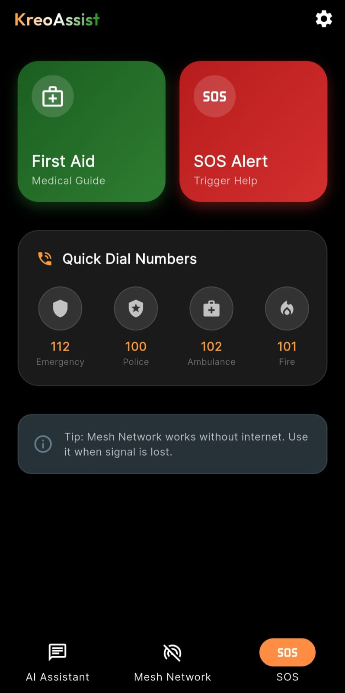
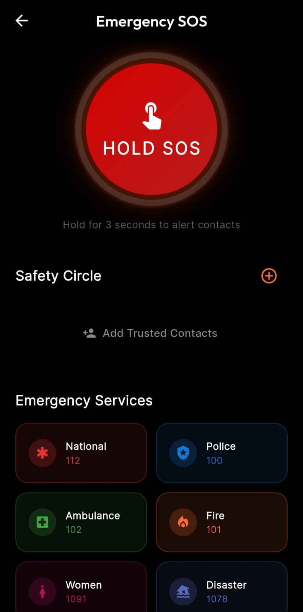
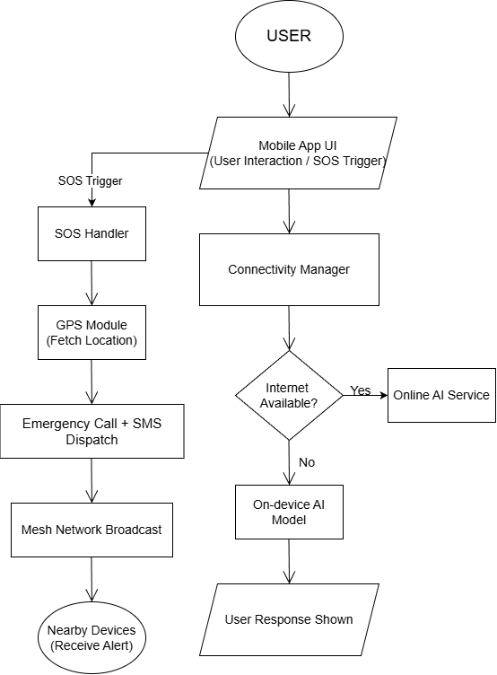
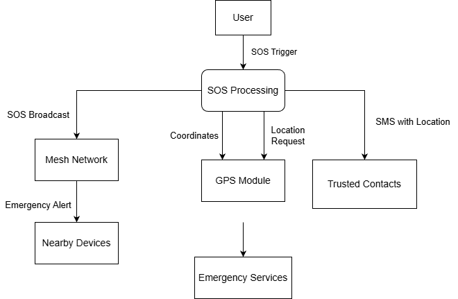
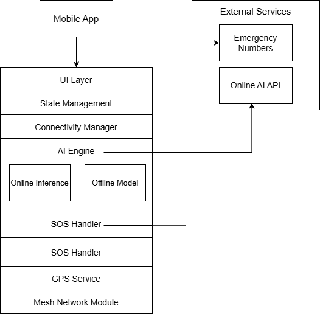

# KreoAssist  
Offline-First Disaster Management & Emergency Assistance Prototype

---

## 📌 Overview

KreoAssist is an offline-first disaster management and emergency assistance application designed for scenarios where conventional communication infrastructure becomes unreliable or unavailable.

The application focuses on **resilience, decentralization, and rapid response** by combining device-to-device mesh communication, hybrid AI-based assistance, and direct emergency actions.  
The current implementation serves as a **functional prototype**, validating critical emergency workflows under real-world constraints rather than aiming for full production deployment.

---

## 🧪 Prototype Status

KreoAssist is implemented as a working prototype with emphasis on **reliability, offline operation, and correctness** during emergency conditions.

### Implemented Prototype Capabilities

- Offline-first application with full usability during network disruptions.
- Hybrid AI assistant with optional offline model download:
  - Users can skip downloading the offline AI model during initial setup.
  - Offline AI can be downloaded later from settings as required.
  - Online AI remains functional without offline model download.
- One-tap SOS system with:
  - Emergency calling to national services (112, 100, 101, 102).
  - Automatic SMS alerts with GPS location to trusted contacts.
- Mesh network communication supporting:
  - Background scanning even when the app is minimized.
  - Local broadcast of emergency alerts to nearby devices.
- Safety circle and trusted contacts management.
- Interactive first-aid guide accessible fully offline.
- Flashlight and SOS Morse-code blinking mode for low-visibility rescue signaling.
- Digital Medical Emergency ID:
  - Stores blood group, allergies, and chronic conditions.
  - Can be displayed persistently on screen for rescuers during unconscious states.
  - Can be shared with trusted contacts.
- Offline maps support:
  - Users can download specific geographic areas.
  - Maps remain usable without internet connectivity.
- In-app feedback and bug reporting system.
- Built-in app versioning and update notification system:
  - Users can check for updates directly within the app.

System scalability, extended integrations, and governance-level deployment considerations are **intentionally planned for the next round**.

---

## 🎯 Problem Statement (Governance Context)

During disasters such as floods, earthquakes, fires, and large-scale accidents:

- Mobile networks may fail or become congested
- Emergency instructions are delayed or inaccessible
- Verified first-aid guidance is unavailable at critical moments
- Centralized systems become single points of failure

KreoAssist addresses these challenges by enabling **decentralized communication, offline intelligence, and rapid local coordination**, aligning with governance-driven disaster response and public safety objectives.

---

## 🌟 Core Features

### 📡 Offline Mesh Communication
- Enables communication without internet using Bluetooth and Wi-Fi Direct
- No dependency on central servers
- Broadcast emergency states such as:
  - NEED HELP
  - I’M SAFE
  - Custom alerts
- Designed to remain operational in network blackout zones

---

### 🧠 Hybrid AI Emergency Assistant (Online + Offline)
- Automatically selects between online inference and on-device models
- Provides first-aid and emergency guidance (CPR, burns, fractures, choking)
- Supports offline processing for privacy and reliability
- Ensures assistance remains available during complete connectivity loss

---

### 🆘 Emergency SOS Dashboard
- One-tap SOS triggers:
  - Emergency calls to national services (112)
  - SMS alerts containing precise GPS coordinates to trusted contacts
- Dedicated direct-dial buttons:
  - Police (100)
  - Fire (101)
  - Ambulance (102)
- Quick safety-status broadcasts for rapid coordination

  
  

---

### 🏥 Offline First-Aid Guide
- Step-by-step instructions for common emergency scenarios
- Categorized access for rapid navigation
- Fully functional without internet connectivity
- AI-assisted follow-up questions when available

---

## 🎨 Design Considerations

- AMOLED-optimized dark theme for reduced battery usage
- Minimal, stress-aware UI design for emergency situations
- Optimized animations for modern mobile devices
- Focus on usability under panic and low-visibility conditions

---

## 🔁 System Flow & Data Flow Diagrams

This section documents the **technical flow charts and data flow diagrams** describing how KreoAssist operates during emergency scenarios.

### 1️⃣ System Flow Chart (High-Level Application Flow)

This flow chart represents the end-to-end execution path of the application under both online and offline conditions.

Flow description:
- User interacts with the application UI
- Connectivity manager determines network availability
- AI requests are routed to:
  - Online inference service (if available), or
  - On-device AI model (offline mode)
- SOS actions trigger GPS retrieval, emergency calls, and alerts
- Emergency packets are broadcast to nearby devices via mesh networking
- Mesh nodes propagate safety status locally

---

### 2️⃣ SOS Data Flow Diagram (DFD)

This DFD illustrates how emergency data moves through the system after an SOS is initiated.

Data flow:
- User initiates SOS
- GPS module provides location coordinates
- SOS handler performs:
  - Emergency call execution
  - SMS delivery to trusted contacts
- SOS message payload is broadcast over the mesh network
- Nearby devices receive and display emergency status updates

---

## 🧩 System Architecture & Technical Flow

KreoAssist follows a modular architecture designed to support both online and offline execution paths.

- User actions originate from the interface layer
- Connectivity manager controls online/offline routing
- AI engine processes queries based on connectivity
- SOS handler manages emergency signaling
- Mesh controller distributes messages to nearby devices

---

## 🛠️ Technology Stack

- Framework: Flutter (Dart)
- State Management: Riverpod
- Connectivity: Bluetooth and Wi-Fi Direct (mesh networking)
- Location Services: Device GPS
- Emergency Handling: Direct phone call and SMS APIs
- Offline Intelligence: On-device language model inference
- Online Intelligence: External inference service (used only when available)

---

## 📁 Project Structure

- lib/  
  Core application logic including UI layers, state management, mesh networking, AI handling, and SOS workflows

- assets/  
  Offline first-aid data, images, and static resources

- docs/  
  Architecture diagrams and technical documentation

Other platform-specific directories (android, ios, macos) follow standard Flutter project conventions.

---

## 🚀 Planned Enhancements for Round 2

In Round 2, KreoAssist will focus on strengthening reliability, scalability, and governance readiness of the already functional system.

### 1. Missing Person Finder (Disaster Context)
- Structured reporting of missing persons during disasters.
- AI-assisted face matching to support identification when connectivity permits.
- Privacy-first workflows and governance-aligned safeguards.
- Integration with local mesh broadcasts and trusted contact coordination.

### 2. Mesh Network Optimization & Scalability
- Message prioritization to ensure SOS alerts override non-critical traffic.
- Message expiration (TTL) to reduce congestion in dense disaster zones.
- Improved multi-hop routing for higher delivery success.
- Targeted communication range expansion of **1–10 km**, depending on user density and environmental conditions.

### 3. Advanced Offline Navigation Enhancements
- Smarter routing using locally available safety data.
- Shared geo-tagged Safe Zones and Danger Zones across nearby devices.
- Improved disaster-aware navigation flows.

### 4. Governance & Institutional Integration
- Integration with verified government and disaster-response alert systems.
- Standardized emergency data formats for interoperability with relief agencies.
- Alignment with national disaster management protocols.

### 5. Accessibility & Language Expansion
- Multilingual support for regional Indian languages.
- Improved UI accessibility for elderly and differently-abled users.

### 6. Voice-Based Emergency Assistance
- Voice-triggered SOS activation for hands-free usage.
- Spoken first-aid instructions during emergencies.
- Multilingual and low-connectivity voice interaction support.

---

## 👥 Team

This project is developed collaboratively by a hackathon team, Kreodev.  
Contributions include application development, system design, and documentation.

---

## 📄 Notes

This repository represents a hackathon prototype focused on validating emergency workflows under real-world constraints.  
The project prioritizes resilience, offline operation, and governance-aligned disaster response.

---

© 2025 Kreodev. All rights reserved.